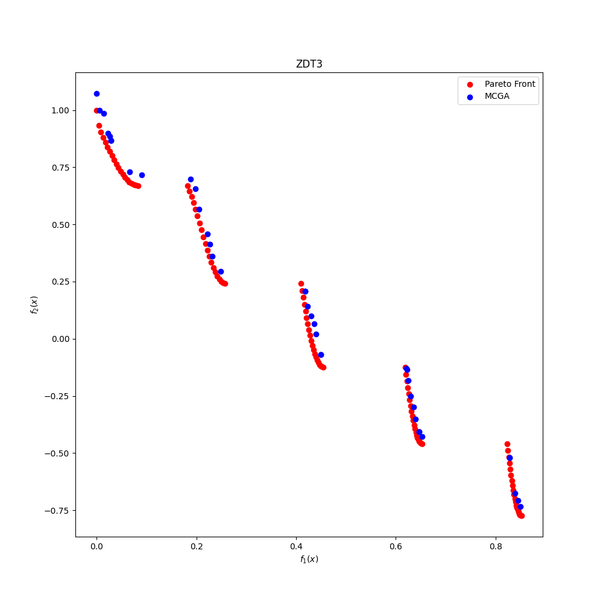
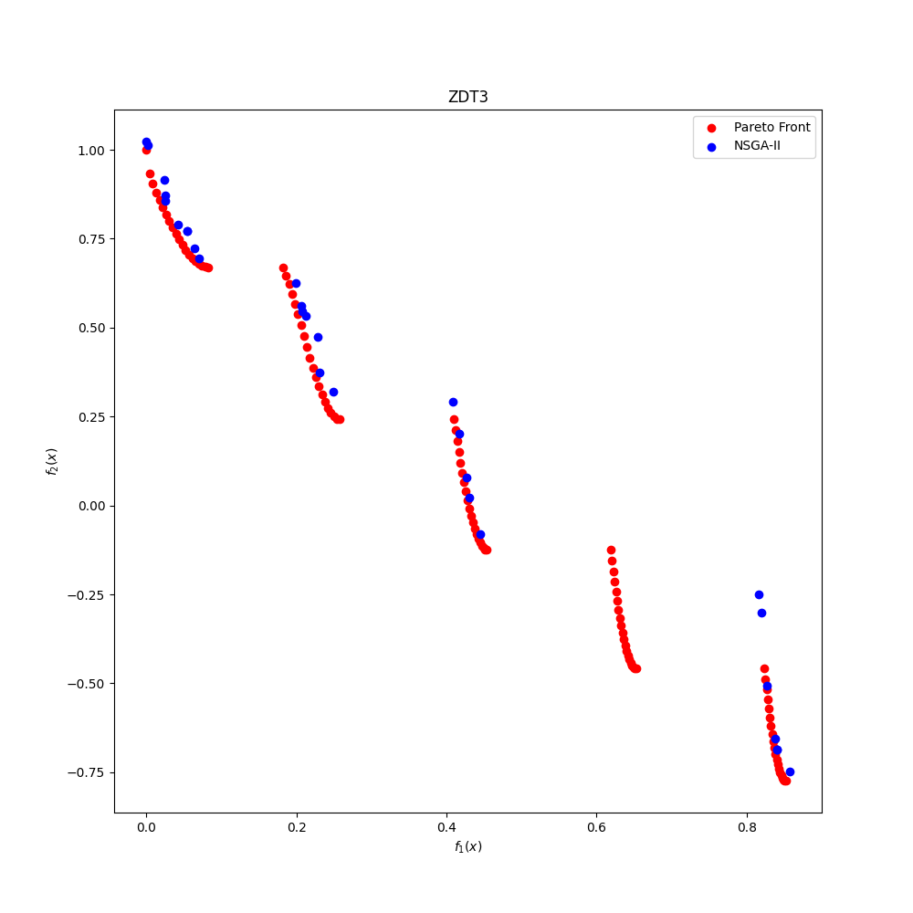

# Monte Carlo Method

Here I explain the ideas and approaches tested to implement the Monte-Carlo method for improving the diversity of the
pareto front solutions in the `NSGA-II` algorithm.

## Introduction

The `NSGA-II` algorithm is a multi-objective optimization algorithm that uses a genetic algorithm to find the pareto
front of a given problem. The algorithm is based on the idea of using a binary tournament selection to select the
individuals that will be used to create the next generation. The algorithm uses a fast non-dominated sorting algorithm
to sort the individuals in the population and assign them a rank. The algorithm also uses a crowding distance
calculation to ensure that the individuals in the pareto front are well distributed.

A problem with the `NSGA-II` algorithm is that it tends to converge to some local optimum. This is because the diversity
is not ensured. Specially in problems with a large number of objectives and complex structures, the fast non-dominated
sort
does not take the spread of the solution into account, as much as it is desired.

Here We propose to use the Monte-Carlo method to improve the diversity of the solutions in the pareto front. The idea
is to randomly slice the population into groups and apply the FNDS algorithm to each group. We repeat this process
several times and then merge the results.

The details will be explained later.

## Tested Approaches

### Approach 1 (Changing the coordinates)

The first approach that was tested was to change the coordinates system of the individuals in the population. The idea
is to
change the coordinates system of the population to polar coordinates. Then we slice the space into random sectors and
apply
the FNDS algorithm to each sector. We repeat this process several times and then merge the results.

In this approach, for each run of the Monte Carlo method, we only use the polar coordinates of the objectives of the
individuals
in th population to do the random slicing. The rest of the information is kept in the original coordinate system.

In testing this approach, I take into account multiple combinations of the objectives and parameters.

#### 1.1. Discarding the crowding distance

In this approach, we discard the crowding distance calculation. This is done to see if the crowding distance is
necessary for the Monte-Carlo method to work. Or in other words, to see if the Monte-Carlo method can improve the
diversity of the solutions by itself.

The result after multiple runs of the Monte-Carlo method is shown in the following figure. For the ZDT3 problem, with
population of 50 individuals and 120 generations, Monte-Carlo method gave better results, even without the crowding
distance calculation.

|               MCGA               |               NSGA-II               |
|:--------------------------------:|:-----------------------------------:|
|  |  |

The implementation for this approach is available in branch `approach1.1` on teh github repository.

#### 1.2. Using the crowding distance as an objective

In this approach, we use the crowding distance as an objective. The crowding distance we use here is somehow different
from the crowding distance used in the NSGA-II algorithm. The crowding distance used in the NSGA-II algorithm promotes
the points that are far from the other points in the pareto front. The crowding distance we use here, trys to populate
the points with high rank and which are far from others.

### Approach 2 (Relaxing the Elitism Conditions and Adding Crowding Distance)

In this approach, we relax the elitism conditions and add the crowding distance calculation to the Monte-Carlo method.
We consider the individuals with front frequencies having close value as equal. Then compute the crowding distance for
these individuals and select the individuals with the highest crowding distance.

We define the value of a front frequency as follows:

$$
v_i = \sum_j^N c_i \times f_{ij}
$$

Where $f_{ij}$ is the frequency of the front $j$ for individual $i$ and $c_i$ is a constant which is bigger for the
first front, the second front, and so on.