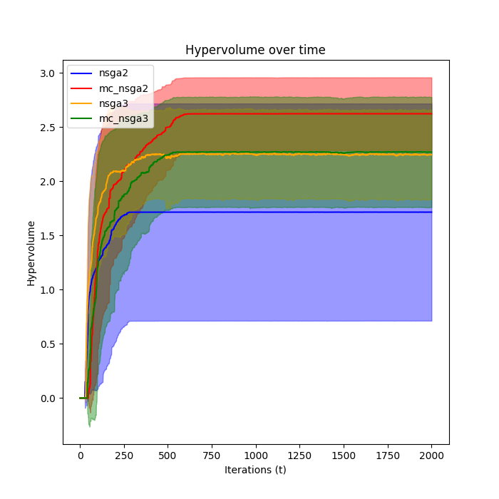
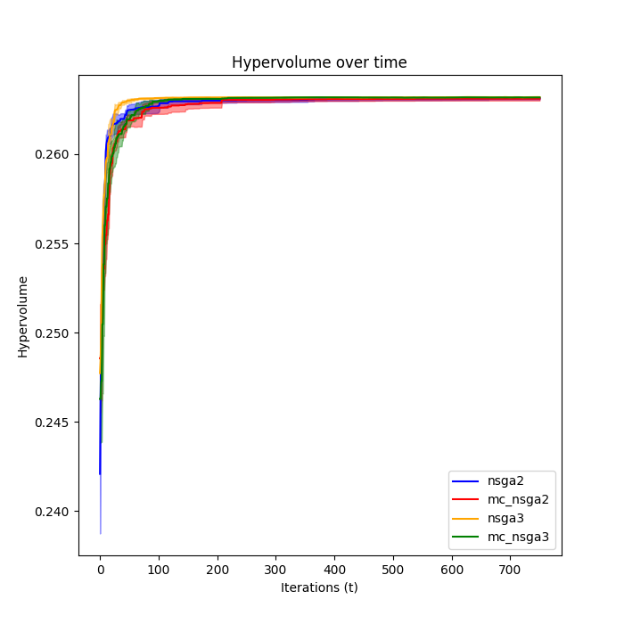
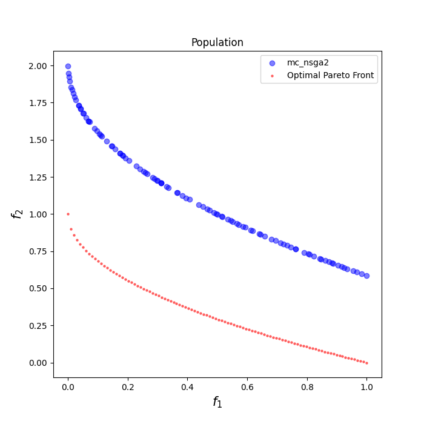
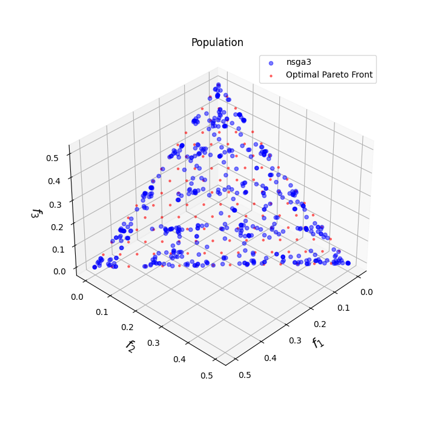
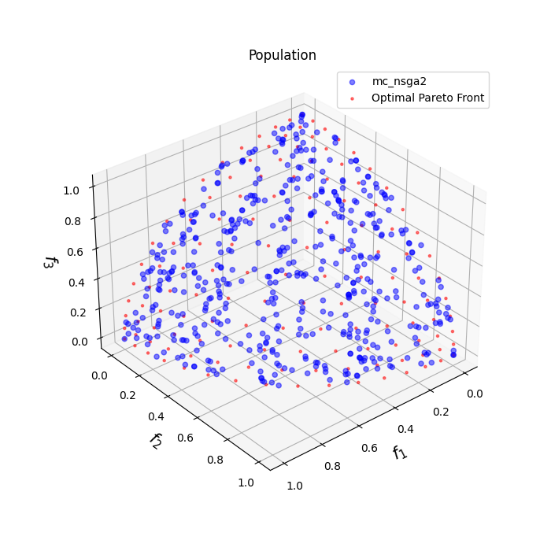
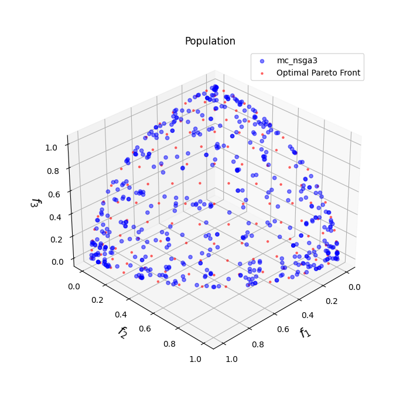
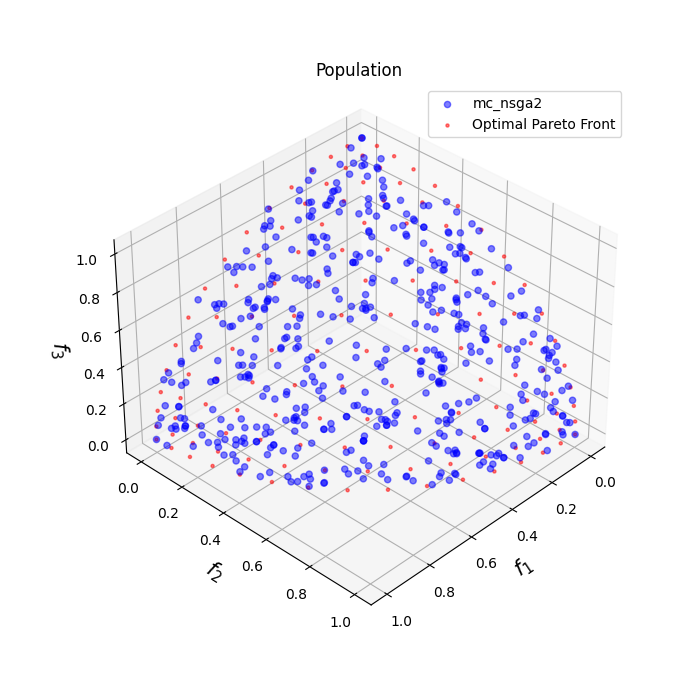

# Monte Carlo Method

Here I explain the ideas and approaches tested to implement the Monte-Carlo method for improving the diversity of the
pareto front solutions in the `NSGA-II` algorithm.

## Introduction

The `NSGA-II` algorithm is a multi-objective optimization algorithm that uses a genetic algorithm to find the pareto
front of a given problem. The algorithm is based on the idea of using a binary tournament selection to select the
individuals that will be used to create the next generation. The algorithm uses a fast non-dominated sorting algorithm
to sort the individuals in the population and assign them a rank. The algorithm also uses a crowding distance
calculation to ensure that the individuals in the pareto front are well distributed.

A problem with the `NSGA-II` algorithm is that it tends to converge to some local optimum. This is because the diversity
is not ensured. Specially in problems with a large number of objectives and complex structures, the fast non-dominated
sort
does not take the spread of the solution into account, as much as it is desired.

Here We propose to use the Monte-Carlo method to improve the diversity of the solutions in the pareto front. The idea
is to randomly slice the population into groups and apply the FNDS algorithm to each group. We repeat this process
several times and then merge the results.

The details will be explained later.

## Tested Approaches

### Approach 1 (Changing the coordinates)

The first approach that was tested was to change the coordinates system of the individuals in the population. The idea
is to
change the coordinates system of the population to polar coordinates. Then we slice the space into random sectors and
apply
the FNDS algorithm to each sector. We repeat this process several times and then merge the results.

In this approach, for each run of the Monte Carlo method, we only use the polar coordinates of the objectives of the
individuals
in th population to do the random slicing. The rest of the information is kept in the original coordinate system.

In testing this approach, I take into account multiple combinations of the objectives and parameters.

#### 1.1. Discarding the crowding distance

In this approach, we discard the crowding distance calculation. This is done to see if the crowding distance is
necessary for the Monte-Carlo method to work. Or in other words, to see if the Monte-Carlo method can improve the
diversity of the solutions by itself.

The result after multiple runs of the Monte-Carlo method is shown in the following figure. For the ZDT3 problem, with
population of 50 individuals and 120 generations, Monte-Carlo method gave better results, even without the crowding
distance calculation.

|               MCGA               |               NSGA-II               |
|:--------------------------------:|:-----------------------------------:|
|  |  |

The implementation for this approach is available in branch `approach1.1` on teh github repository.

#### 1.2. Using the crowding distance as an objective

In this approach, we use the crowding distance as an objective. The crowding distance we use here is somehow different
from the crowding distance used in the NSGA-II algorithm. The crowding distance used in the NSGA-II algorithm promotes
the points that are far from the other points in the pareto front. The crowding distance we use here, trys to populate
the points with high rank and which are far from others.

### Approach 2 (Relaxing the Elitism Conditions and Adding Crowding Distance)

#### 2.1

In this approach, we relax the elitism conditions and add the crowding distance calculation to the Monte-Carlo method.
We consider the individuals with front frequencies having close value as equal. Then compute the crowding distance for
these individuals and select the individuals with the highest crowding distance.

We define the value of a front frequency as follows:

$$
v_i = \sum_j^N c_i \times f_{ij}
$$

Where $f_{ij}$ is the frequency of the front $j$ for individual $i$ and $c_i$ is a constant which is bigger for the
first front, the second front, and so on.

#### 2.2

I also tried another thing. Instead of slicing the polar space in random sectors, I uniformly slice the polar space and
then rotate it with a random angle.

## Using the Monte-Carlo Method as a general improvement method on other algorithms

I tried to augment the other typical algorithms with the Monte-Carlo method to see if it can improve the results. For
this purpose, in order to preserve the structure and performance of the base algorithm, either you have to apply the MC
method on a portion of the population, or you have to apply it on the whole population but just in some iterations.

I used `NSGA-II` and `NSGA-III` as the base algorithms. I applied the MC method on a portion of the population in the
first, and the results where unsatisfactory. Then I applied the MC method on the whole population in some iterations,
and the results where better. Even though the results where better in some cases, it was not consistent. In some tests,
the `NSGA-III` itself was slightly better than the augmented version.

At first I tried to implement the `NSGA-III` algorithm. I have conducted three implementations of NSGA-III. The initial
two attempts encountered issues with both convergence and diversity. hese instances demanded a notable iteration range
of 500 to 700, alongside a population size spanning 200 to 300 for DTLZ problems, consuming nearly double the resources
of NSGA-II. Ultimately, their outcomes did not significantly surpass those of the conventional method.

In my exploration, I came across the "deap" library which proved to be highly versatile. This library offers an array of
algorithms, and my contribution to the implementation involved the creation of selection functions. Notably, the library
itself had already implemented the nd-sort mechanism. Additionally, the platform facilitated effortless testing of
various algorithm configurations, including distinct mating strategies and the like.

For instance, I observed that the SBX mating method exhibited superior performance in contrast to the real-valued
approach.

In this approach, I used the first method of the MC elitism conditions with no relaxing, but used the uniform polar
space slicing with random rotation.

I had an idea about the algorithm and that it can be effective on the problems with a wide pareto front, with a discrete
pattern. So I looked for test problems with complex pareto fronts, those that have a degenerate form and some real-world
problems with awkward shapes. explanation about these problems is available in attached pdf files.

I tested the implementation on `ZDT`, `DTLZ`, `CPFT`, `OKA` and `RE` problems. The comparison of the hypervolume of the
results is shown in the following figure.

|                     ZDT1                     |                      ZDT2                       |                     ZDT3                     |                      ZDT4                       |
|:--------------------------------------------:|:-----------------------------------------------:|:--------------------------------------------:|:-----------------------------------------------:|
|          |             |          |             |

|                 DTLZ1                 |                      DTLZ2                      |                    DTLZ3                     |                 DTLZ4                 |
|:-------------------------------------:| :---------------------------------------------: | :------------------------------------------: |:-------------------------------------:|
|  |            |         |  |

|                    CPFT2                     |                      CPFT3                      |                    CPFT4                     |                      ZDT4                       |
| :------------------------------------------: | :---------------------------------------------: | :------------------------------------------: | :---------------------------------------------: |
|         |            |         |             |

|                 OKA1                 |                 OKA2                 |                 RE1                 |                 RE5                 |
|:------------------------------------:|:------------------------------------:|:-----------------------------------:|:-----------------------------------:|
|  |  |  |  |

And Here is the result populations of the `NSGA-II` and `NSGA-III` algorithms and their augmented versions.

|                  NSGA-II                   |                   MCNSGA-II                   |                  NSGA-III                  |                   MCNSGA-II                   |
|:------------------------------------------:|:---------------------------------------------:|:------------------------------------------:|:---------------------------------------------:|
|   |   |   |   |
|   |   |   |   |
|   |   |   |   |
|   |   |   |   |
|  |  |  |  |
|  |  |  |  |
|  |  |  |  |
|  |  |  |  |
|   |   |   |   |

For Each test, I have saved the used parameters in the `parameters` folder. I have also saved the result populations of
each method.

## Current Status

Currently, I am working on testing my implementation on the printer model. After reading the code and the reference
paper again, I have noticed some
differences. I will test all the configuration to see if these differences are the source of the behavior I have
observed in my tests.

One big difference is that in the original implementation of the printer model, the previous population is not
completely discarded. The new population is created by adding the new individuals to the previous population, and then
another selection is done to select the individuals that will be used in the next generation. This is different from the
implementation I have done, where the previous population is completely discarded. Another difference is that in the
Original implementation, the polar slicing is done on the performance space, which is different from the objective
space, while I apply it in the objective space. Other differences are in the mating and mutation operators.

### Baseline

At first, I try to tun the `NSGA-II` algorithm with the same parameters as to have a baseline to compare the results
with. This is the result.

|                                    |                                      |                                    |                                      |                                  |                                      |
|:------------------------------------------:|:---------------------------------------------:|:------------------------------------------:|:------------------------------------:|:------------------------------------------:|:---------------------------------------------:|
| ||||||
| ||||||
| ||||||
| ||||||
| ||||||

### Approach 1

In the first approach, I only change the sorting algorithm, and let everything else the same. i.e. I use the same mating
and mutation operators as the `NSGA-II` algorithm, do not use the crowding distance, and do not relax the elitism and
discard
the population. This is the result.

