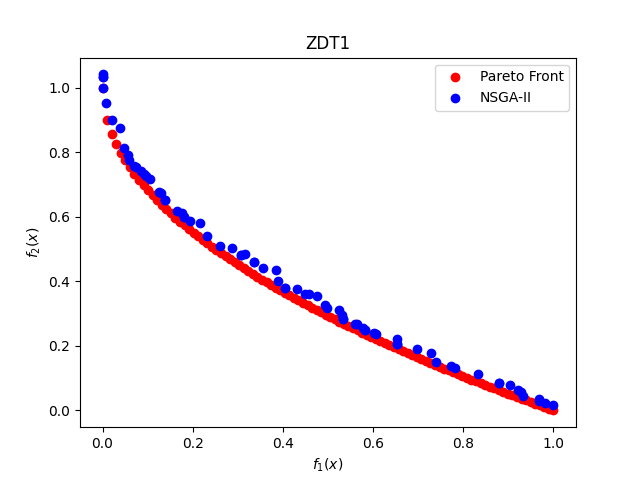
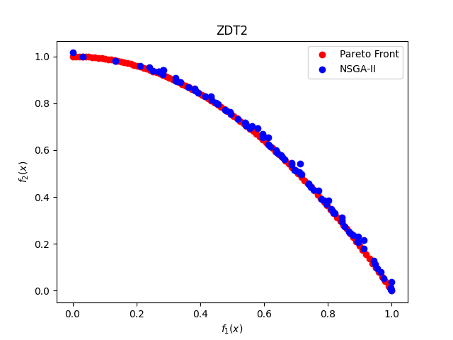
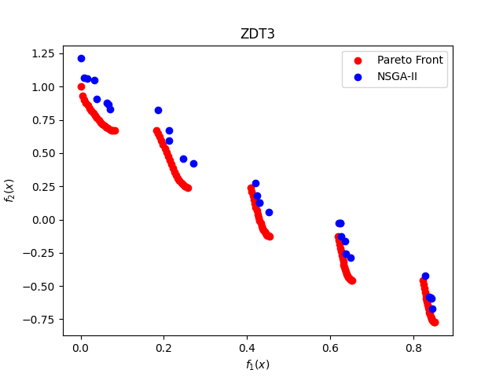
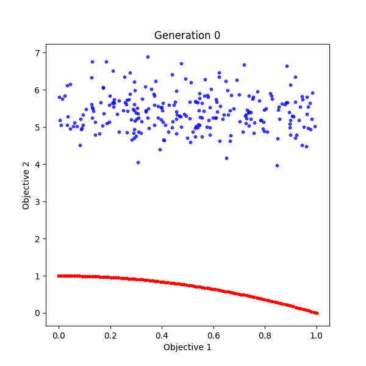
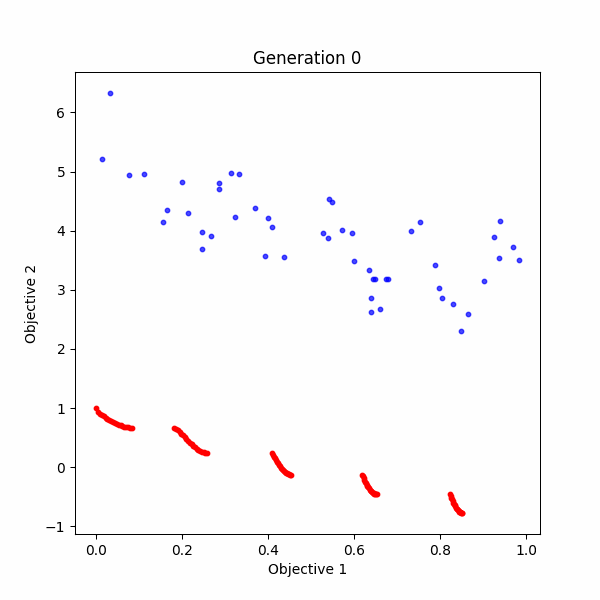

# NSGA-II Implementation

## Introduction

This report is a summary of the implementation of the NSGA-II algorithm. The algorithm is implemented in Python 3.9.2.
The code is available on [GitHub](https://github.com/naser-kazemi/NSGA-II.git).

## NSGA-II Algorithm

The NSGA-II algorithm is a multi-objective genetic algorithm. The algorithm is based on the concept of Pareto dominance.
The algorithm is implemented in the following steps:

1. Initialization
2. Create an initial population of size N
3. Fast non-dominated sort
4. Crowding distance assignment
5. Create a new population
6. Select the next generation
7. Repeat from step 3 until the termination criteria is met
8. Return the best solution

### Initialization

The algorithm starts with an initial population of size N. The initial population is created by randomly generating N
individuals. Each individual is a list of real numbers. The length of the list is equal to the number of decision
variables. The values of the decision variables are randomly generated between the lower and upper bounds of the
decision variables.

### Fast non-dominated sort

The fast non-dominated sort is used to divide the population into different fronts. The first front contains the
non-dominated individuals. The second front contains the individuals that are dominated by the individuals in the first
front. The third front contains the individuals that are dominated by the individuals in the first and second fronts.
And so on. The fast non-dominated sort is implemented in the following steps:

1. Create an empty list of fronts
2. Create an empty list of individuals that are dominated by other individuals
3. Create an empty list of individuals that dominate other individuals
4. Create an empty list of individuals that are not dominated by any other individuals
5. For each individual in the population:
    1. Set the domination count of the individual to 0
    2. Create an empty list of individuals that the individual dominates
    3. For each other individual in the population:
        1. If the individual dominates the other individual:
            1. Add the other individual to the list of individuals that the individual dominates
        2. Else if the other individual dominates the individual:
            1. Increment the domination count of the individual by 1
    4.
        1. If the domination count of the individual is equal to 0:
           Add the individual to the list of individuals that are not dominated by any other individuals
        2. Else if the domination count of the individual is greater than 0:
           Add the individual to the list of individuals that dominate other individuals
        3. Else:
           Add the individual to the list of individuals that are dominated by other individuals
6. Add the list of individuals that are not dominated by any other individuals to the list of fronts
7. Set the current front to 0
8. While the current front is less than the number of fronts:
    1. Create an empty list of individuals for the next front
    2. For each individual in the current front:
        1. For each individual that the individual dominates:
            1. Decrement the domination count of the individual by 1
            2. If the domination count of the individual is equal to 0:
                1. Add the individual to the list of individuals for the next front
    3. Add the list of individuals for the next front to the list of fronts
    4. Increment the current front by 1
    5. Return the list of fronts

### Crowding distance assignment

The crowding distance assignment is used to select the individuals for the next generation. The crowding distance is
used to select the individuals that are located in the middle of the front. The crowding distance is calculated for
each individual in the front. The crowding distance is calculated by summing the distances between the two closest
individuals in the front for each objective.

### Create a new population

The new population is created by selecting the individuals with the highest crowding distance. The new population is
created by selecting the individuals with the highest crowding distance from the first front. If the number of
individuals in the new population is less than the population size, the individuals with the highest crowding distance
from the second front are added to the new population. If the number of individuals in the new population is less than
the population size, the individuals with the highest crowding distance from the third front are added to the new
population. And so on.

### Select the next generation

The next generation is selected by randomly selecting two individuals from the new population. The two individuals are
compared using the crowding distance. The individual with the highest crowding distance is selected for the next
generation. The process is repeated until the next generation is full.

## Implementation

The implementation of the NSGA-II algorithm is available
on [GitHub]([GitHub](https://github.com/naser-kazemi/NSGA-II.git). The implementation is based on the following
classes:

- `Member`: The `Member` class represents an individual in the population. The class contains the following attributes:
    - `chromosome`: A list of real numbers representing the decision variables of the individual.
    - `objective_values`: A list of real numbers representing the objective values of the individual.
    - `dominated_by_count`: An integer representing the number of individuals that dominate the individual.
    - `rank`: An integer representing the rank of the individual.
    - `crowding_distance`: A real number representing the crowding distance of the individual.

- `Population`: The `Population` class represents a population of individuals. The class contains the following
  attributes:
    - `population`: A list of `Member` objects representing the individuals in the population.

- `MOOP` (Multi-Objective Optimization Problem): The `MOOP` class represents a multi-objective optimization problem.
  The class contains the following attributes:
    - `num_variables`: An integer representing the number of decision variables.
    - `objectives`: A list of functions representing the objectives.
    - `num_objectives`: An integer representing the number of objectives.
    - `pareto_front`: A list of `np.array` objects representing the Pareto front.
    - `lower_bounds`: A list of real numbers representing the lower bounds of the variables
    - `upper_bounds`: A list of real numbers representing the upper bounds of the variables

- `NSGA2`: The `NSGA2` class represents the NSGA-II algorithm. The class contains the following attributes:
    - `moop`: A `MOOP` object representing the multi-objective optimization problem.
    - `num_generation`: An integer representing the number of generations.
    - `population_size`: An integer representing the population size.
    - `population`: A `Population` object representing the population.
    - offsprings: A `Population` object representing the offsprings.
    - `crossover_probability`: A real number representing the crossover probability.
    - `mutation_probability`: A real number representing the mutation probability.
    - `tournament_size`: An integer representing the tournament size.
    - `eta_crossover`: A real number representing the eta crossover parameter.
    - `eta_mutation`: A real number representing the eta mutation parameter.

## Performance Evaluation

The performance of the NSGA-II algorithm is evaluated using the following multi-objective optimization problems:

- ZDT test suite
- DTLZ test suite
- Kursawe problem
- Schaffer problem
- Fonseca problem
- Poloni problem

### ZDT test suite

The ZDT test suite is a set of test problems for multi-objective optimization. The ZDT test suite is used to evaluate
the performance of the NSGA-II algorithm.

For evaluation purposes, I used the following ZDT 1, 2 and 3 test problems. The tests are executed with population size
of $n=100$, $100$ generations for ZDT1 and ZD2, with crossover probability of $0.9$ and mutation probability of
$\frac{1}{n}$. The "
\eta_crossover" and "\eta_mutation" parameters are set to $20$. You can see the results of the tests below:

1. #### ZDT1

The ZDT1 problem is a two-objective optimization problem. The first objective is to minimize the value of the first
decision variable. The second objective is to minimize the value of the second decision variable. The decision
variables are real numbers between 0 and 1. The Pareto front of the ZDT1 problem is a straight line connecting the
points (0, 1) and (1, 0).

The objective functions of the ZDT1 problem are defined as follows:

$$\begin{aligned}
f_1(x) &= x_1 \\
f_2(x) &= g(x) \cdot h(f_1(x), g(x)) \\
g(x) &= 1 + \frac{9}{n - 1} \sum_{i=2}^{n} x_i \\
h(f_1(x), g(x)) &= 1 - \sqrt{\frac{f_1(x)}{g(x)}}
\end{aligned}$$

The following figure shows the Pareto front of the ZDT1 problem:

2. #### ZDT2

The ZDT2 problem is a two-objective optimization problem. The first objective is to minimize the value of the first
decision variable. The second objective is to minimize the value of the second decision variable. The decision
variables are real numbers between 0 and 1. The Pareto front of the ZDT2 problem is a straight line connecting the

The objective functions of the ZDT2 problem are defined as follows:

$$\begin{aligned}
f_1(x) &= x_1 \\
f_2(x) &= g(x) \cdot h(f_1(x), g(x)) \\
g(x) &= 1 + \frac{9}{n - 1} \sum_{i=2}^{n} x_i \\
h(f_1(x), g(x)) &= 1 - \left(\frac{f_1(x)}{g(x)}\right)^2
\end{aligned}$$

The following figure shows the Pareto front of the ZDT2 problem:

3. #### ZDT3

The ZDT3 problem is a two-objective optimization problem. The first objective is to minimize the value of the first
decision variable. The second objective is to minimize the value of the second decision variable. The decision
variables are real numbers between 0 and 1. The Pareto front of the ZDT3 problem is a straight line connecting the
points (0, 1) and (1, 0).

The objective functions of the ZDT3 problem are defined as follows:

$$\begin{aligned}
f_1(x) &= x_1 \\
f_2(x) &= g(x) \cdot h(f_1(x), g(x)) \\
g(x) &= 1 + \frac{9}{n - 1} \sum_{i=2}^{n} x_i \\
h(f_1(x), g(x)) &= 1 - \sqrt{\frac{f_1(x)}{g(x)}} - \frac{f_1(x)}{g(x)} \cdot \sin(10 \pi f_1(x))
\end{aligned}$$

The following figure shows the Pareto front of the ZDT3 problem:

### Algorithm Generations Visualization

The following GIFs show the visualization of the algorithm generations for the ZDT2 and ZDT3 problems:

ZDT2            |  ZDT3
:-------------------------:|:-------------------------:
  |  

## Challenges

At first I implemented the algorithm using the `numpy` library. However, I found that the algorithm was very slow. Even
in some parts it was giving unexpected results. For example, In the non-dominated sort part, some it gave wrong results
and some members got lost in the process. e.g. no fronts were assigned to them. I found that the `numpy` library was not
suitable for this kind of
algorithm. So I decided to implement the algorithm using the python built-in lists. This made the algorithm much faster
and more reliable.

## Next Steps

For the next steps of the projects, I am going to implement a Monte-Carlo approach to the NSGA-II algorithm. The
Method is a combination of the NSGA-II algorithm and the and slicing the population into random sections and applying
the non-dominated sort algorithm to each section.
